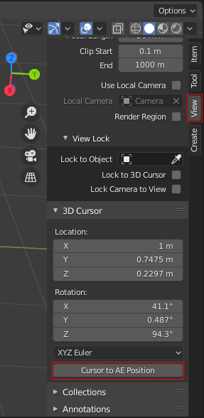
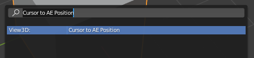

# blender-cursor-to-ae
Copy the Blender 3D cursor position to the clipboard as After Effects keyframe data

## Usage
[Download the `blender-cursor-to-ae.py` file](https://github.com/adroitwhiz/blender-cursor-to-ae/raw/master/blender-cursor-to-ae.py) and install it as a Blender addon.

The addon will add a "Cursor to AE Position" button in the 3D Cursor properties under the View tab in the Properties panel:

This button, when pressed, will copy the cursor position into the clipboard as After Effects keyframe data. You can then paste this into After Effects by selecting a 3D layer or one of its spatial properties (Anchor Point or Position) then using Ctrl+V to paste.

This action can also be accessed via the operators menu (F3):

The position of the 3D cursor will be converted from Blender-space (positive Z values are up) to After Effects-space (positive Y values are down).

By default, it also multiplies coordinates by 100 (this matches the remapping that the Cineware plugin does). This can be disabled in the addon preferences.
